# CI/CD 파이프라인 전체 프로세스 가이드

## 목차
1. [개요](#개요)
2. [전체 아키텍처](#전체-아키텍처)
3. [구성 요소 설명](#구성-요소-설명)
4. [상세 프로세스](#상세-프로세스)
5. [실제 배포 흐름 예시](#실제-배포-흐름-예시)
6. [무중단 배포](#무중단-배포)

---

## 개요

### CI/CD란?

**CI (Continuous Integration, 지속적 통합)**
- 개발자가 코드를 변경하면 자동으로 빌드하고 테스트하는 프로세스
- 코드 품질을 유지하고 버그를 조기에 발견

**CD (Continuous Deployment, 지속적 배포)**
- CI를 통과한 코드를 자동 또는 수동으로 운영 환경에 배포하는 프로세스
- 빠르고 안정적인 배포 가능

### 이 프로젝트에서 사용하는 도구

| 도구 | 역할 | 설명 |
|------|------|------|
| **AWS CodeCommit** | 소스 코드 저장소 | Git 기반 프라이빗 레포지토리 |
| **Jenkins** | CI 도구 | 빌드, 테스트, 이미지 생성 자동화 |
| **AWS ECR** | 컨테이너 레지스트리 | Docker 이미지 저장소 |
| **ArgoCD** | CD 도구 | GitOps 기반 Kubernetes 배포 |
| **AWS EKS** | 컨테이너 오케스트레이션 | Kubernetes 클러스터 |

---

## 전체 아키텍처

### 시스템 구성도

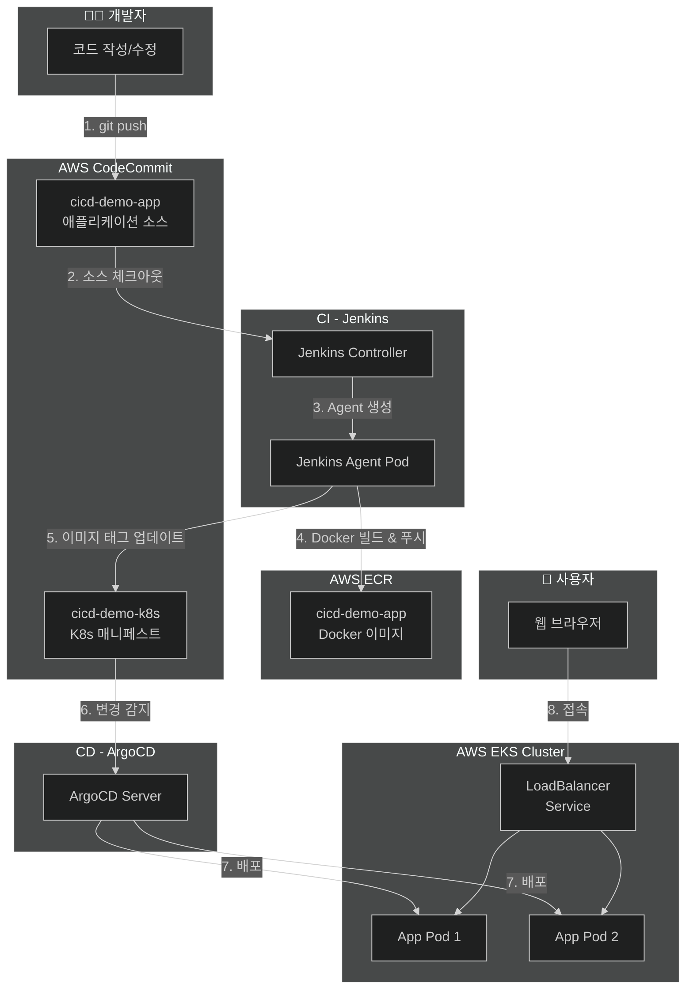

### GitOps 패턴 설명

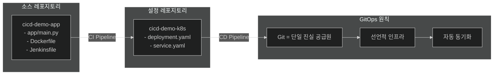

**왜 레포지토리를 분리하나요?**

1. **관심사의 분리**: 애플리케이션 코드와 배포 설정을 독립적으로 관리
2. **권한 분리**: 개발자는 소스 코드만, 운영팀은 배포 설정만 관리 가능
3. **배포 이력 추적**: 배포 변경사항만 별도로 추적 가능
4. **롤백 용이**: 배포 설정만 롤백 가능

---

## 구성 요소 설명

### 1. AWS CodeCommit (Git 저장소)

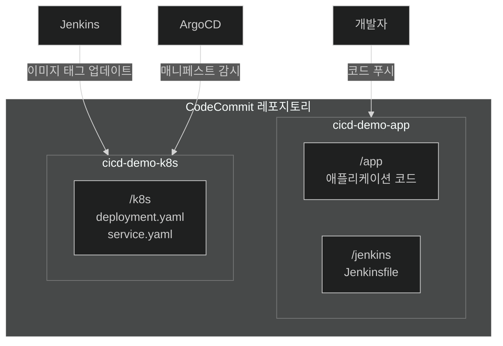

**역할:**
- `cicd-demo-app`: 애플리케이션 소스 코드와 빌드 설정 (Jenkinsfile) 저장
- `cicd-demo-k8s`: Kubernetes 배포 매니페스트 저장 (ArgoCD가 감시)

---

### 2. Jenkins (CI 도구)

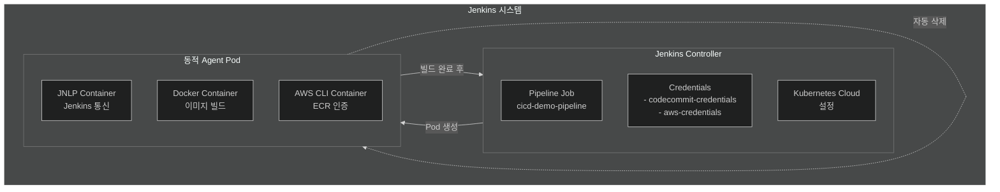

**역할:**
- 소스 코드 체크아웃
- Docker 이미지 빌드
- ECR에 이미지 푸시
- K8s 매니페스트 레포지토리 업데이트

**Jenkins Agent Pod의 특징:**
- 빌드 시에만 동적으로 생성
- 빌드 완료 후 자동 삭제
- 리소스 효율적 사용

---

### 3. AWS ECR (컨테이너 레지스트리)

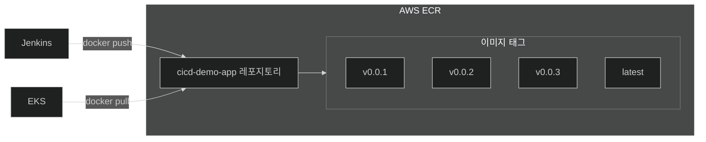

**역할:**
- Docker 이미지 저장 및 버전 관리
- EKS에서 이미지 Pull

---

### 4. ArgoCD (CD 도구)

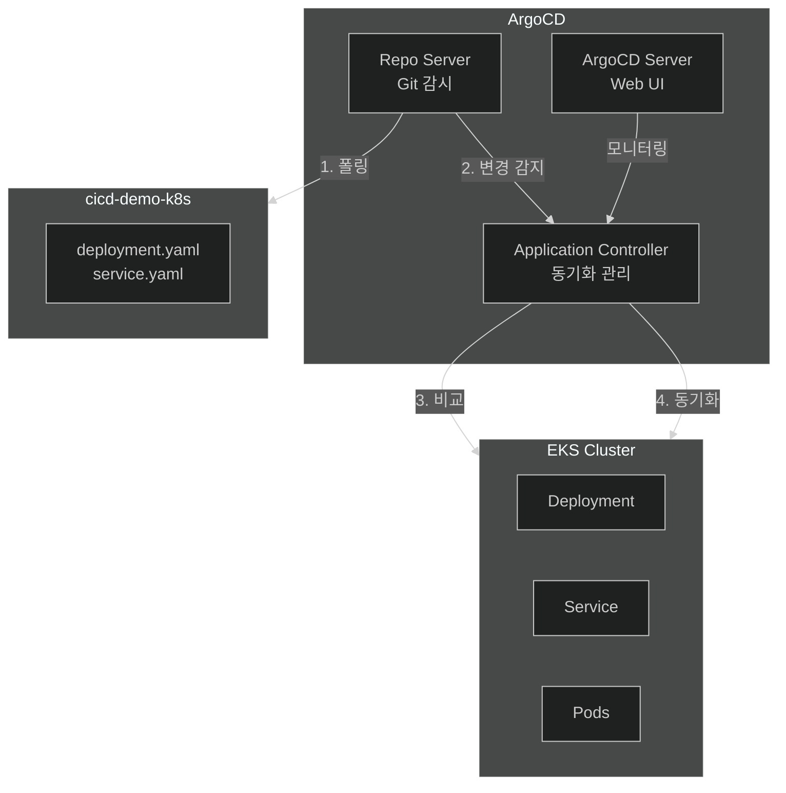

**역할:**
- Git 레포지토리 변경 감시
- Kubernetes 클러스터와 Git 상태 비교
- 차이 발생 시 동기화 (자동 또는 수동)

**동기화 모드:**
| 모드 | 설명 |
|------|------|
| **Auto Sync** | Git 변경 감지 시 자동 배포 |
| **Manual Sync** | 사용자가 Sync 버튼 클릭 시 배포 |

---

### 5. AWS EKS (Kubernetes 클러스터)

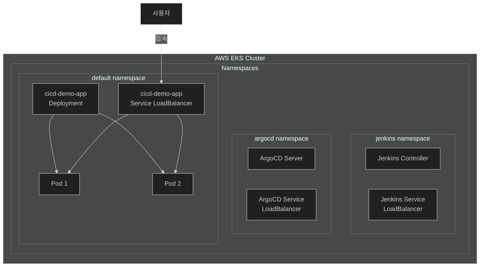

**역할:**
- 컨테이너 오케스트레이션
- 서비스 로드밸런싱
- 자동 복구 및 스케일링

---

## 상세 프로세스

### 전체 파이프라인 흐름

```mermaid
%%{init: {'theme': 'dark'}}%%
sequenceDiagram
    participant DEV as 👨‍💻 개발자
    participant APP as CodeCommit<br/>(cicd-demo-app)
    participant JC as Jenkins<br/>Controller
    participant JA as Jenkins<br/>Agent Pod
    participant ECR as AWS ECR
    participant K8S as CodeCommit<br/>(cicd-demo-k8s)
    participant ARGO as ArgoCD
    participant EKS as EKS Pods
    participant USER as 👤 사용자

    Note over DEV,USER: 🚀 CI/CD 파이프라인 시작

    rect rgb(30, 60, 90)
        Note over DEV,APP: Step 1: 코드 푸시
        DEV->>DEV: main.py 버전 수정<br/>(v0.0.2 → v0.0.3)
        DEV->>APP: git push origin main
    end

    rect rgb(90, 60, 30)
        Note over APP,ECR: Step 2-5: CI (Jenkins)
        DEV->>JC: Build Now 클릭
        JC->>JA: Agent Pod 생성
        JA->>APP: 소스 코드 체크아웃
        JA->>JA: 버전 파싱 (v0.0.3)
        JA->>JA: Docker 이미지 빌드
        JA->>ECR: 이미지 푸시<br/>(v0.0.3, latest)
    end

    rect rgb(30, 90, 60)
        Note over JA,K8S: Step 6: 매니페스트 업데이트
        JA->>K8S: deployment.yaml 수정<br/>(image: v0.0.3)
        JA->>JC: 빌드 완료
        JC->>JA: Agent Pod 삭제
    end

    rect rgb(90, 30, 60)
        Note over K8S,EKS: Step 7-8: CD (ArgoCD)
        ARGO->>K8S: 변경 감지
        ARGO->>ARGO: Out of Sync 상태
        DEV->>ARGO: Sync 클릭 (수동 모드)
        ARGO->>EKS: Rolling Update 시작
        EKS->>EKS: 새 Pod 생성 (v0.0.3)
        EKS->>EKS: 기존 Pod 종료 (v0.0.2)
        ARGO->>ARGO: Synced 상태
    end

    rect rgb(50, 50, 90)
        Note over EKS,USER: Step 9: 배포 확인
        USER->>EKS: /version 접속
        EKS->>USER: {"version": "v0.0.3"}
    end
```

---

### Step 1: 코드 푸시

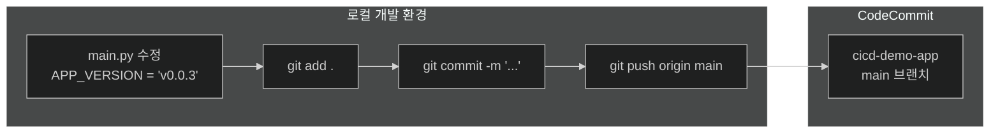

**개발자가 하는 일:**
1. `app/main.py` 파일에서 `APP_VERSION` 값 수정
2. 변경사항 커밋 및 푸시

**이 단계에서 일어나는 일:**
- 소스 코드가 CodeCommit에 저장됨
- 아직 아무 자동화도 트리거되지 않음 (수동 빌드 설정)

---

### Step 2: Jenkins 빌드 트리거

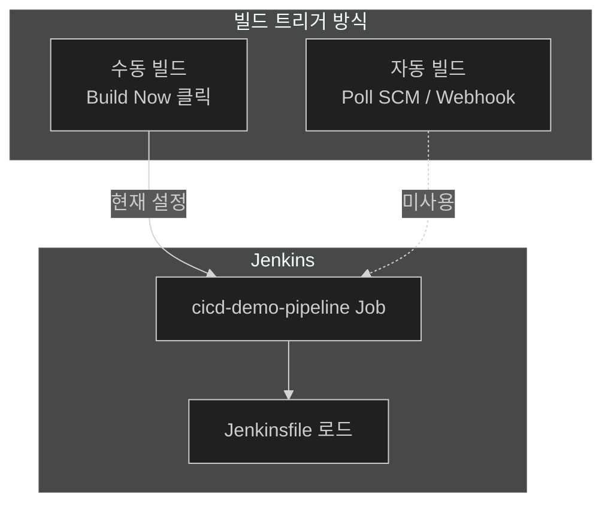

**현재 설정: 수동 빌드**
- Jenkins 대시보드에서 `Build Now` 클릭
- 원하는 시점에 배포 제어 가능

**자동 빌드 옵션 (미사용):**
- Poll SCM: 주기적으로 Git 변경 확인
- Webhook: Git 푸시 시 자동 트리거

---

### Step 3: Jenkins Agent Pod 생성

```mermaid
%%{init: {'theme': 'dark'}}%%
flowchart TB
    subgraph Controller["Jenkins Controller"]
        PIPELINE[Pipeline 실행]
        K8S_PLUGIN[Kubernetes Plugin]
    end

    subgraph K8sAPI["Kubernetes API"]
        CREATE[Pod 생성 요청]
    end

    subgraph AgentPod["Jenkins Agent Pod"]
        subgraph Containers["컨테이너"]
            JNLP[jnlp<br/>Jenkins 통신]
            DOCKER[docker<br/>Docker-in-Docker]
            AWS[aws-cli<br/>AWS 명령어]
        end

        subgraph Volume["공유 볼륨"]
            WORKSPACE[/home/jenkins/agent<br/>작업 공간]
        end
    end

    PIPELINE --> K8S_PLUGIN
    K8S_PLUGIN --> CREATE
    CREATE --> AgentPod
    JNLP --> WORKSPACE
    DOCKER --> WORKSPACE
    AWS --> WORKSPACE
```

**Agent Pod 구성:**
| 컨테이너 | 이미지 | 역할 |
|----------|--------|------|
| jnlp | jenkins/inbound-agent | Jenkins와 통신 |
| docker | docker:24-dind | Docker 빌드 실행 |
| aws-cli | amazon/aws-cli | AWS 명령어 실행 |

**공유 볼륨의 중요성:**
- 모든 컨테이너가 같은 작업 공간 사용
- ECR 비밀번호 파일 공유 등에 활용

---

### Step 4: Docker 이미지 빌드 & ECR 푸시

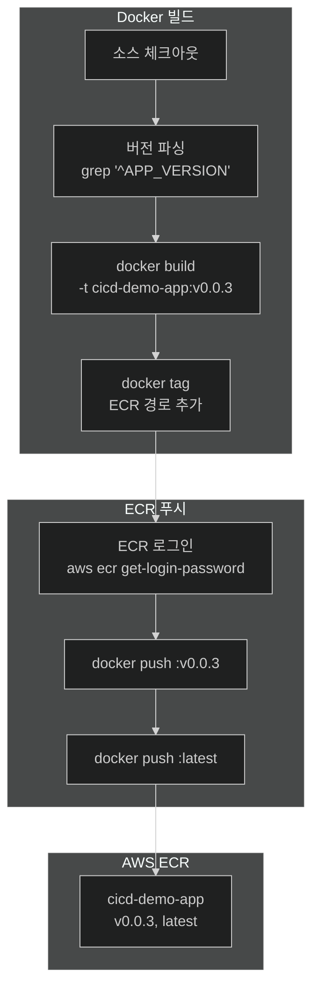

**빌드 과정:**
1. CodeCommit에서 소스 코드 체크아웃
2. `main.py`에서 버전 문자열 추출
3. Dockerfile 기반으로 이미지 빌드
4. ECR 경로로 태그 지정
5. ECR에 로그인 후 푸시

---

### Step 5: K8s 매니페스트 업데이트

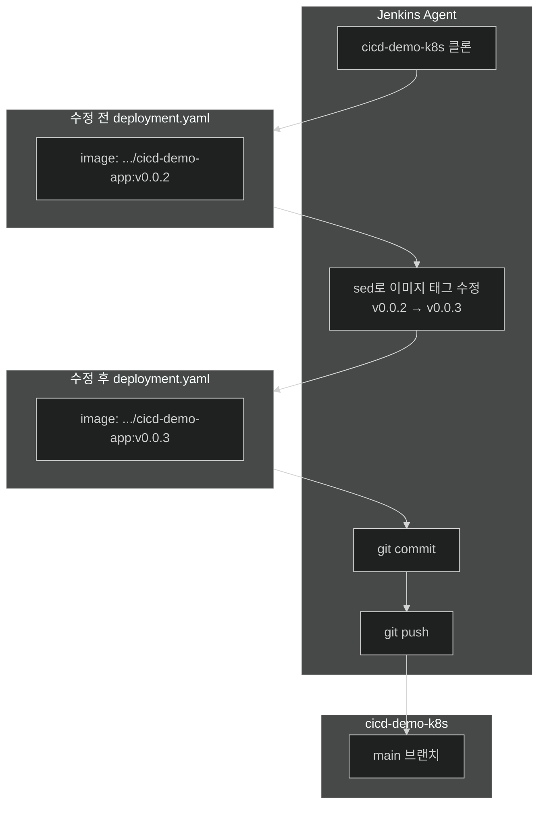

**이 단계의 핵심:**
- Jenkins가 K8s 매니페스트 레포지토리의 이미지 태그를 자동 업데이트
- ArgoCD가 이 변경을 감지하여 배포 트리거

---

### Step 6: ArgoCD 동기화

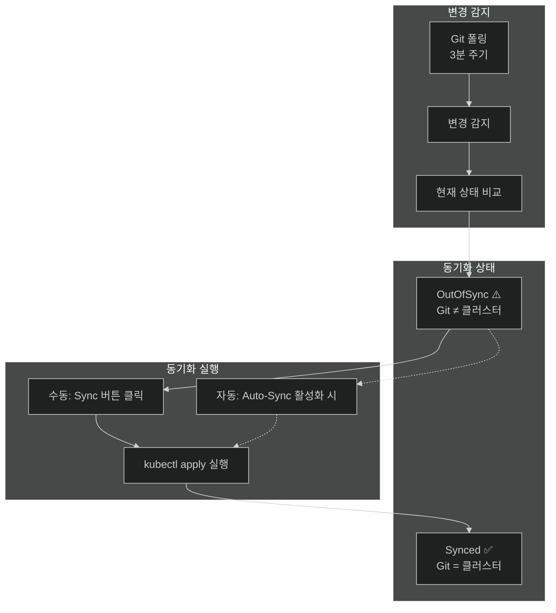

**ArgoCD 동기화 상태:**
| 상태 | 의미 | 아이콘 |
|------|------|--------|
| Synced | Git과 클러스터가 동일 | ✅ 녹색 |
| OutOfSync | Git과 클러스터가 다름 | ⚠️ 노란색 |
| Unknown | 상태 확인 불가 | ❓ 회색 |

---

### Step 7: Kubernetes Rolling Update

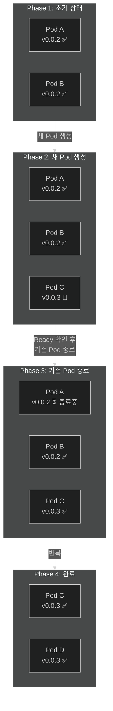

**Rolling Update 특징:**
- 점진적으로 Pod 교체
- 서비스 중단 없음
- Ready 상태 확인 후 다음 단계 진행

---

### Step 8: 배포 완료 및 확인

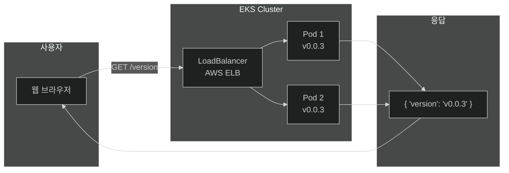

**확인 방법:**
- 브라우저에서 `/version` 엔드포인트 접속
- 새 버전 확인 (v0.0.3)

---

## 실제 배포 흐름 예시

### v0.0.2 → v0.0.3 업데이트 시나리오

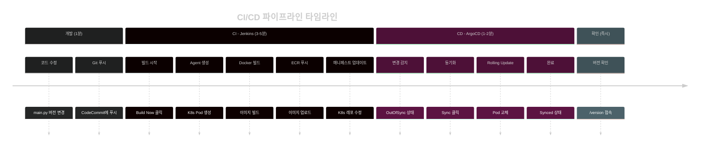

---

## 무중단 배포

### Rolling Update 동작 원리

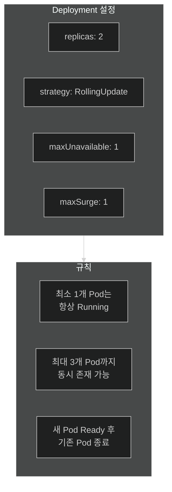

### Graceful Shutdown 과정

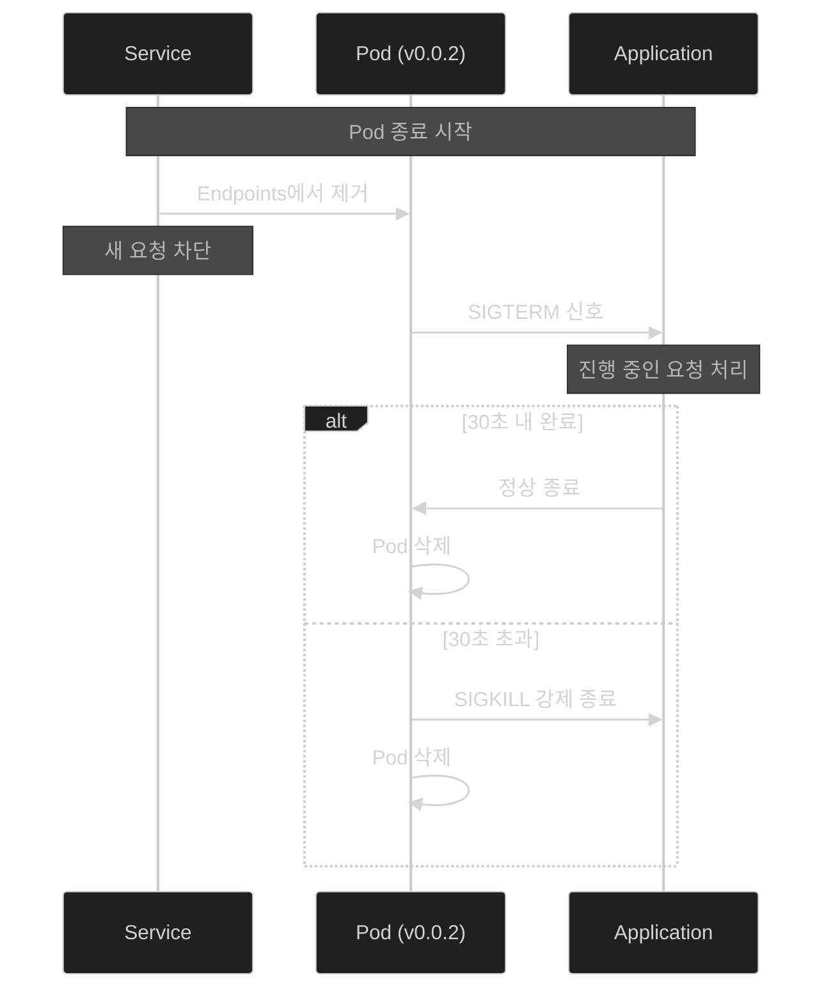

**무중단 배포 핵심:**
| 설정 | 기본값 | 설명 |
|------|--------|------|
| terminationGracePeriodSeconds | 30초 | Pod 종료 대기 시간 |
| maxUnavailable | 25% | 동시 종료 가능 Pod 수 |
| maxSurge | 25% | 추가 생성 가능 Pod 수 |

---

## 요약

### CI/CD 파이프라인 한눈에 보기

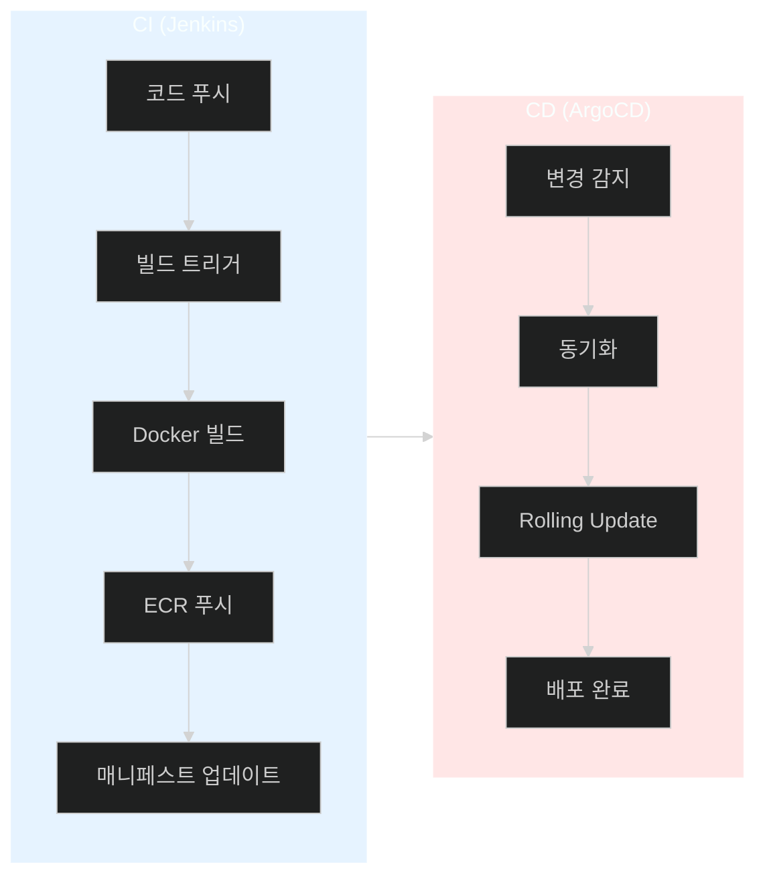

### 핵심 포인트

1. **GitOps**: Git이 모든 상태의 단일 진실 공급원
2. **자동화**: 코드 푸시 → 배포까지 자동화 (수동 트리거 가능)
3. **무중단**: Rolling Update로 서비스 중단 없이 배포
4. **추적성**: 모든 변경사항이 Git에 기록됨
5. **롤백**: 이전 버전으로 쉽게 롤백 가능

---

## 다음 단계

- [ ] 자동 빌드 트리거 설정 (Webhook)
- [ ] 자동 동기화 활성화 (Auto-Sync)
- [ ] 모니터링 도구 연동 (Prometheus, Grafana)
- [ ] 알림 설정 (Slack, Email)
