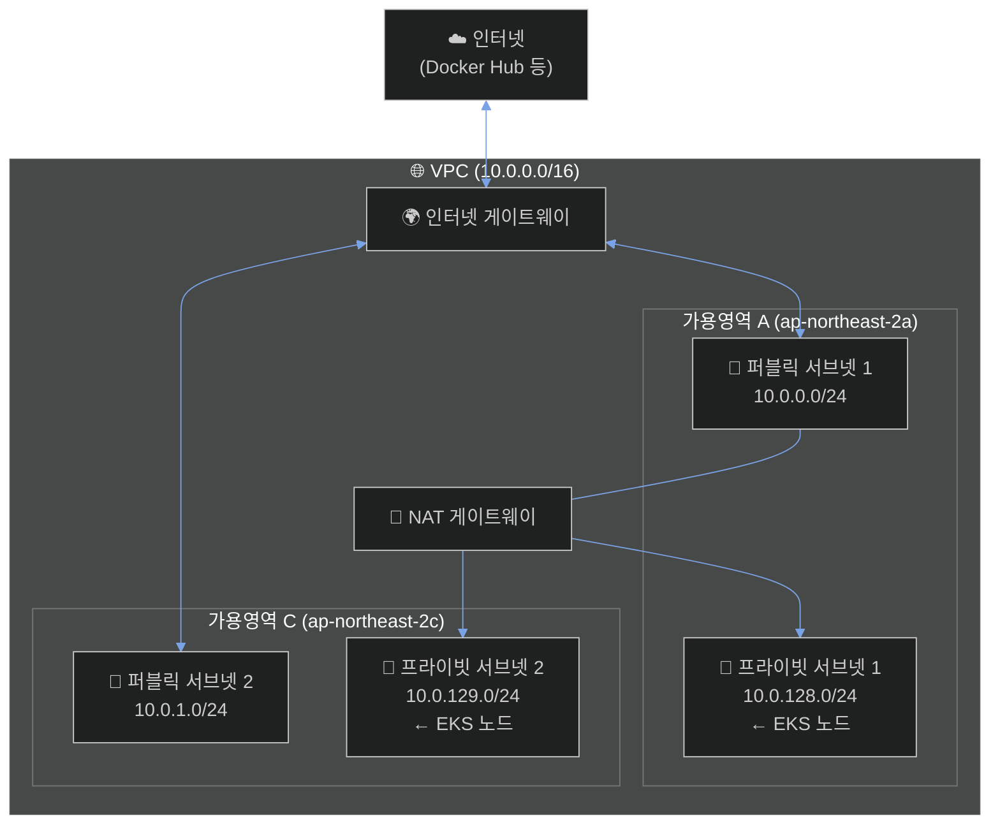
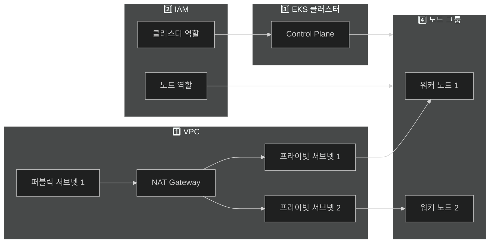

# AWS 콘솔 수동 설정 가이드 (실무 방식)

Terraform 없이 AWS 콘솔에서 직접 리소스를 생성하는 가이드입니다.
**실무와 동일한 수동 구성 방식**으로 진행합니다.

---

## 📋 생성할 리소스 목록

| 순서 | 서비스 | 리소스 |
|------|--------|--------|
| 1 | VPC | 네트워크 (NAT Gateway 포함) |
| 2 | IAM | EKS 역할 생성 |
| 3 | EKS | 클러스터 (수동 구성) |
| 4 | EKS | 노드 그룹 |
| 5 | ECR | 컨테이너 이미지 저장소 |
| 6 | CodeCommit | Git 저장소 |
| 7 | - | kubectl 설정 (로컬 PC) |
| 8 | CodeCommit | 코드 Push |

---

# 0️⃣ 기존 리소스 정리 (해당되는 경우)

기존 EKS Auto Mode 클러스터가 있다면 먼저 삭제합니다.

1. AWS 콘솔 → **EKS** → 클러스터 선택
2. **삭제** 클릭
3. 클러스터 이름 입력 후 삭제 확인

⏳ 삭제에 약 5-10분 소요

---

# 1️⃣ VPC 생성 (NAT Gateway 포함)

## VPC 구조 다이어그램



### 핵심 포인트

| 구성 요소 | 역할 | 위치 |
|----------|------|------|
| **인터넷 게이트웨이** | VPC ↔ 인터넷 연결 | VPC 레벨 |
| **NAT 게이트웨이** | 프라이빗 → 인터넷 (아웃바운드만) | 퍼블릭 서브넷 |
| **EKS 노드** | 워크로드 실행 | 프라이빗 서브넷 |
| **Load Balancer** | 외부 트래픽 수신 (Jenkins, ArgoCD) | 퍼블릭 서브넷 |

> 💡 **NAT Gateway가 있어야** 프라이빗 서브넷의 EKS 노드가 Docker Hub에서 이미지를 Pull 할 수 있습니다!

## VPC 마법사 사용

1. AWS 콘솔 → **VPC** 검색 → 클릭
2. **VPC 생성** 클릭
3. **VPC 등** 선택 (VPC, 서브넷, 라우팅 테이블 자동 생성)
4. 설정:
   - 이름 태그 자동 생성: `cicd-demo`
   - IPv4 CIDR 블록: `10.0.0.0/16`
   - IPv6 CIDR 블록: **없음**
   - 테넌시: **기본값**
   - 가용 영역(AZ) 수: **2**
   - 퍼블릭 서브넷 수: **2**
   - 프라이빗 서브넷 수: **2**
   - **NAT 게이트웨이: 1개의 AZ에서** ← 중요!
   - VPC 엔드포인트: **없음**
5. **VPC 생성** 클릭

⏳ 생성에 약 2-3분 소요

## 생성 후 확인사항

생성된 리소스 확인:
- VPC 1개
- 서브넷 4개 (퍼블릭 2개, 프라이빗 2개)
- 인터넷 게이트웨이 1개
- NAT 게이트웨이 1개
- 라우팅 테이블 (퍼블릭, 프라이빗)

---

# 2️⃣ IAM 역할 생성

## 2-1. EKS 클러스터 역할

1. AWS 콘솔 → **IAM** → **역할** → **역할 생성**
2. 신뢰할 수 있는 엔터티 유형: **AWS 서비스**
3. 사용 사례: **EKS** → **EKS - Cluster**
4. **다음** 클릭
5. 정책 확인: `AmazonEKSClusterPolicy` 자동 선택됨
6. **다음** 클릭
7. 역할 이름: `cicd-demo-eks-cluster-role`
8. **역할 생성** 클릭

## 2-2. EKS 노드 그룹 역할

1. **IAM** → **역할** → **역할 생성**
2. 신뢰할 수 있는 엔터티 유형: **AWS 서비스**
3. 사용 사례: **EC2**
4. **다음** 클릭
5. 정책 검색 및 선택 (3개 모두 선택):
   - ✅ `AmazonEKSWorkerNodePolicy`
   - ✅ `AmazonEKS_CNI_Policy`
   - ✅ `AmazonEC2ContainerRegistryReadOnly`
6. **다음** 클릭
7. 역할 이름: `cicd-demo-eks-node-role`
8. **역할 생성** 클릭

---

# 3️⃣ EKS 클러스터 생성 (수동 구성)

## 마스터 vs 워커 노드

| 구분 | 마스터 노드 (Control Plane) | 워커 노드 (Data Plane) |
|------|---------------------------|----------------------|
| **생성** | 이 단계에서 자동 생성 | 4️⃣ 노드 그룹에서 생성 |
| **관리** | AWS 완전 관리형 | 사용자 관리 |
| **EC2 확인** | ❌ 불가 | ✅ 가능 |
| **역할** | API Server, etcd 등 | Pod 실행 |
| **비용** | $0.10/시간 (고정) | 인스턴스별 |

> 💡 EKS 장점: 마스터 노드는 AWS가 관리하므로 워커 노드만 신경 쓰면 됩니다!

## 클러스터 생성

1. AWS 콘솔 → **EKS** 검색 → 클릭
2. **클러스터 생성** 클릭
3. **사용자 지정 구성** 선택 ← Auto Mode 아님!
4. 설정:

### 1단계: 클러스터 구성
- 이름: `cicd-demo-eks`
- Kubernetes 버전: `1.31` (또는 기본값)
- 클러스터 서비스 역할: `cicd-demo-eks-cluster-role`
- **다음** 클릭

### 2단계: 네트워킹 지정
- VPC: `cicd-demo-vpc` 선택
- 서브넷: **4개 모두 선택** (퍼블릭 2개 + 프라이빗 2개)
- 보안 그룹: 기본값 사용 (자동 생성)
- 클러스터 엔드포인트 액세스: **퍼블릭 및 프라이빗**
- **다음** 클릭

### 3단계: 관찰성 구성
- 기본값 유지
- **다음** 클릭

### 4단계: 추가 기능 선택
- 기본값 유지 (Amazon VPC CNI, CoreDNS, kube-proxy)
- **다음** 클릭

### 5단계: 검토 및 생성
- 설정 확인 후 **생성** 클릭

⏳ **클러스터 생성에 약 10-15분 소요**

---

# 4️⃣ 노드 그룹 생성

클러스터가 **Active** 상태가 되면 진행합니다.

1. 생성된 클러스터 클릭
2. **컴퓨팅** 탭 → **노드 그룹 추가** 클릭

### 1단계: 노드 그룹 구성
- 이름: `cicd-demo-node-group`
- 노드 IAM 역할: `cicd-demo-eks-node-role`
- **다음** 클릭

### 2단계: 컴퓨팅 및 크기 조정 구성
- AMI 유형: `Amazon Linux 2023 (AL2023_x86_64_STANDARD)`
- 용량 유형: **온디맨드**
- 인스턴스 유형: `t3.medium`
- 디스크 크기: `20` GiB
- 크기 조정 구성:
  - 원하는 크기: `2`
  - 최소 크기: `1`
  - 최대 크기: `3`
- **다음** 클릭

### 3단계: 네트워킹 지정
- 서브넷: **프라이빗 서브넷 2개만 선택** ← 중요!
  - `cicd-demo-subnet-private1-xxx`
  - `cicd-demo-subnet-private2-xxx`
- **다음** 클릭

### 4단계: 검토 및 생성
- 설정 확인 후 **생성** 클릭

⏳ **노드 그룹 생성에 약 5-10분 소요**

## 지금까지 생성한 전체 아키텍처



> 퍼블릭 서브넷 2는 나중에 ALB(Load Balancer) 생성 시 사용됩니다.

### 구성 요약

| 단계 | 생성된 리소스 | 핵심 포인트 |
|------|-------------|------------|
| 1️⃣ VPC | VPC, 서브넷 4개, NAT | 프라이빗 서브넷에서 인터넷 접근 가능 |
| 2️⃣ IAM | 역할 2개 | 클러스터용, 노드용 |
| 3️⃣ EKS | Control Plane | AWS 관리형 마스터 노드 |
| 4️⃣ 노드 | 워커 노드 2개 | 프라이빗 서브넷에 배치 (t3.medium) |

---

# 5️⃣ ECR 생성

1. AWS 콘솔 → **ECR** 검색 → 클릭
2. 왼쪽 메뉴 **프라이빗 레지스트리** → **리포지토리**
3. **리포지토리 생성** 클릭
4. 설정:
   - 표시 여부: **프라이빗**
   - 리포지토리 이름: `cicd-demo-app`
   - 태그 변경 가능성: **Mutable**
   - 푸시할 때 스캔: ✅ 활성화
5. **리포지토리 생성** 클릭

---

# 6️⃣ CodeCommit 저장소 생성

## 저장소 1: 애플리케이션 코드

1. AWS 콘솔 → **CodeCommit** 검색 → 클릭
2. **리포지토리 생성** 클릭
3. 설정:
   - 리포지토리 이름: `cicd-demo-app`
   - 설명: `CI/CD Demo Application`
4. **생성** 클릭

## 저장소 2: Kubernetes 매니페스트

1. **리포지토리 생성** 클릭
2. 설정:
   - 리포지토리 이름: `cicd-demo-k8s`
   - 설명: `Kubernetes manifests for GitOps`
3. **생성** 클릭

## HTTPS Git 자격 증명 생성 ⚠️ 중요!

1. AWS 콘솔 → **IAM** → **사용자**
2. 본인 사용자 클릭
3. **보안 자격 증명** 탭
4. 스크롤하여 **AWS CodeCommit에 대한 HTTPS Git 자격 증명** 섹션
5. **자격 증명 생성** 클릭
6. **사용자 이름**과 **비밀번호** 저장 (⚠️ 다시 볼 수 없음!)

---

# 7️⃣ kubectl 설정 (로컬 PC에서 실행)

## 7-1. 사전 설치 확인

```bash
# kubectl 설치 (없으면)
brew install kubectl

# AWS CLI 설치 (없으면)
brew install awscli

# AWS 자격 증명 설정 (처음 한 번만)
aws configure
```

## 7-2. EKS 클러스터 연결

```bash
aws eks update-kubeconfig --region ap-northeast-2 --name cicd-demo-eks
```

## 7-3. 연결 확인

```bash
kubectl get nodes
```

### 예상 결과

```
NAME                                               STATUS   ROLES    AGE   VERSION
ip-10-0-xx-xxx.ap-northeast-2.compute.internal    Ready    <none>   5m    v1.31.x
ip-10-0-xx-xxx.ap-northeast-2.compute.internal    Ready    <none>   5m    v1.31.x
```

> ✅ 노드 2개가 Ready 상태이고 **Taint가 없으면** 성공!

### Taint 확인

```bash
kubectl describe nodes | grep -A2 "Taints:"
```

결과가 `Taints: <none>`이면 정상입니다.

---

# 8️⃣ CodeCommit에 코드 Push

## 8-1. 프로젝트 디렉토리로 이동

```bash
cd ~/Library/Mobile\ Documents/com~apple~CloudDocs/cicd
```

## 8-2. Git 설정 (이미 Push한 경우 remote 변경)

```bash
# 기존 remote 삭제 (이미 있는 경우)
git remote remove origin 2>/dev/null

# 새 remote 추가
git remote add origin https://git-codecommit.ap-northeast-2.amazonaws.com/v1/repos/cicd-demo-app

# Push
git push -u origin main
```

---

# 💰 비용 정보

| 리소스 | 비용 |
|--------|------|
| EKS 클러스터 | ~$0.10/시간 (~$72/월) |
| NAT Gateway | ~$0.045/시간 + 데이터 전송 |
| EC2 (t3.medium x 2) | ~$0.08/시간 |
| **총합** | **약 $6-8/일** |

---

# 🗑️ 리소스 정리 (비용 절약)

⚠️ **실습 후 반드시 삭제하세요!**

## 삭제 순서 (중요!)

1. **EKS 노드 그룹** 삭제 (EKS → 클러스터 → 컴퓨팅 → 노드 그룹)
2. **EKS 클러스터** 삭제
3. **NAT 게이트웨이** 삭제 (VPC → NAT 게이트웨이)
4. **Elastic IP** 해제 (VPC → 탄력적 IP)
5. **VPC** 삭제
6. **ECR 이미지** 삭제 후 **리포지토리** 삭제
7. **CodeCommit** 저장소 삭제
8. **IAM 역할** 삭제

---

# ✅ 체크리스트

- [ ] 기존 Auto Mode 클러스터 삭제
- [ ] VPC 생성 완료 (NAT Gateway 포함)
- [ ] IAM 역할 2개 생성 완료
- [ ] EKS 클러스터 생성 완료 (수동 구성)
- [ ] 노드 그룹 생성 완료
- [ ] ECR 리포지토리 생성 완료
- [ ] CodeCommit 저장소 2개 생성 완료
- [ ] kubectl 연결 성공 (`kubectl get nodes`)
- [ ] Taint 없음 확인
- [ ] CodeCommit에 코드 Push 완료

---

# 다음 단계

AWS 리소스 생성 및 코드 Push가 완료되면:

1. [STEP5-JENKINS.md](./STEP5-JENKINS.md) - Jenkins 설치 (Helm)
2. [STEP6-ARGOCD.md](./STEP6-ARGOCD.md) - ArgoCD 설치
3. [STEP7-PIPELINE.md](./STEP7-PIPELINE.md) - 파이프라인 구성
4. [STEP8-TEST.md](./STEP8-TEST.md) - 전체 테스트 (v0.0.1 → v0.0.2)

순서대로 진행하세요!
