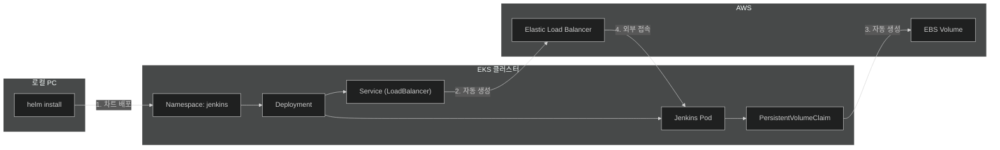

# 5단계: Jenkins 설치 (Helm)

## Helm으로 Jenkins 설치 흐름



### 설치 과정 요약

| 순서 | 동작 | 결과 |
|------|------|------|
| 1 | `helm install` 실행 | K8s 리소스 생성 (Deployment, Service, PVC) |
| 2 | Service (LoadBalancer) 생성 | AWS가 자동으로 ELB 프로비저닝 |
| 3 | PVC 생성 | AWS가 자동으로 EBS 볼륨 생성 |
| 4 | Pod 실행 | Jenkins 컨테이너 시작 |
| 5 | ELB DNS로 접속 | 브라우저에서 Jenkins UI 접근 |

---

## 사전 조건
- EKS 클러스터가 실행 중이어야 합니다
- kubectl이 EKS에 연결되어 있어야 합니다
- Helm이 설치되어 있어야 합니다

## Helm 설치 (아직 없는 경우)

```bash
# macOS
brew install helm

# 확인
helm version
```

---

## 1. Jenkins Helm Repository 추가

```bash
helm repo add jenkins https://charts.jenkins.io
helm repo update
```

---

## 2. Jenkins 네임스페이스 생성

```bash
kubectl create namespace jenkins
```

---

## 3. Jenkins 설치

```bash
# 프로젝트 디렉토리로 이동
cd cicd

# Helm으로 Jenkins 설치
helm install jenkins jenkins/jenkins \
  --namespace jenkins \
  -f jenkins/values.yaml
```

---

## 4. Jenkins 접속 정보 확인

```bash
# 설치 상태 확인
kubectl get pods -n jenkins -w

# 외부 IP 확인 (LoadBalancer)
kubectl get svc -n jenkins

# Admin 비밀번호 확인 (values.yaml에 설정하지 않은 경우)
kubectl exec --namespace jenkins -it svc/jenkins -c jenkins -- /bin/cat /run/secrets/additional/chart-admin-password && echo
```

---

## 5. Jenkins 접속

1. `kubectl get svc -n jenkins`에서 EXTERNAL-IP 확인
2. 브라우저에서 `http://[EXTERNAL-IP]:8080` 접속
3. ID: `admin`, PW: `admin123!` (values.yaml에서 설정한 값)

---

## 6. Jenkins Credentials 설정 (3개 필요)

### 6-1. AWS Account ID (Secret text)

1. **Jenkins 관리** → **Manage Credentials**
2. **System** → **Global credentials (unrestricted)**
3. **Add Credentials** 클릭
4. 설정:
   - Kind: **Secret text**
   - Secret: `123456789012` (본인의 12자리 AWS 계정 ID)
   - ID: `aws-account-id`
5. **Save** 클릭

### 6-2. AWS Credentials (Access Key)

1. **Add Credentials** 클릭
2. 설정:
   - Kind: **AWS Credentials**
   - ID: `aws-credentials`
   - Access Key ID: [YOUR_AWS_ACCESS_KEY]
   - Secret Access Key: [YOUR_AWS_SECRET_KEY]
3. **Save** 클릭

> Access Key 발급: IAM → 사용자 → 보안 자격 증명 → 액세스 키 만들기

### 6-3. CodeCommit Git Credentials

1. **Add Credentials** 클릭
2. 설정:
   - Kind: **Username with password**
   - Username: [CodeCommit HTTPS Git 사용자 이름]
   - Password: [CodeCommit HTTPS Git 비밀번호]
   - ID: `codecommit-credentials`
3. **Save** 클릭

> Git 자격 증명 발급: IAM → 사용자 → 보안 자격 증명 → AWS CodeCommit에 대한 HTTPS Git 자격 증명

---

## 7. CodeCommit 연동 설정

### IAM 사용자에 CodeCommit 권한 추가

```bash
# AWS CLI로 권한 확인
aws iam list-attached-user-policies --user-name [YOUR_USER_NAME]
```

### Git Credential Helper 설정 (Jenkins 서버에서)

```bash
# Jenkins pod에 접속
kubectl exec -it -n jenkins deploy/jenkins -- bash

# Git credential helper 설정
git config --global credential.helper '!aws codecommit credential-helper $@'
git config --global credential.UseHttpPath true
```

---

## 8. Jenkins Pipeline 작업 생성

### 새 Item 생성

1. **New Item** 클릭
2. 이름: `cicd-demo-pipeline`
3. 타입: **Pipeline** 선택
4. **OK** 클릭

### Pipeline 설정

1. **Pipeline** 섹션으로 이동
2. **Definition**: `Pipeline script from SCM`
3. **SCM**: `Git`
4. **Repository URL**: `https://git-codecommit.ap-northeast-2.amazonaws.com/v1/repos/cicd-demo-app`
5. **Credentials**: 위에서 생성한 credentials 선택
6. **Branch Specifier**: `*/main`
7. **Script Path**: `jenkins/Jenkinsfile`
8. **Save** 클릭

---

## 9. Webhook 설정 (자동 트리거)

### CodeCommit 트리거 설정

1. AWS Console → CodeCommit → cicd-demo-app
2. **Settings** → **Triggers** → **Create trigger**
3. 설정:
   - Trigger name: `jenkins-trigger`
   - Events: **Push to existing branch**
   - Branch name: `main`
   - Service details: **AWS Lambda** 또는 **SNS**

### Jenkins에서 Webhook 수신 설정

1. **Configure** → **Build Triggers**
2. **GitHub hook trigger for GITScm polling** 활성화
3. 또는 **Poll SCM** 설정: `H/5 * * * *` (5분마다 확인)

---

## 트러블슈팅

### Pod가 시작되지 않는 경우
```bash
kubectl describe pod -n jenkins -l app.kubernetes.io/name=jenkins
kubectl logs -n jenkins -l app.kubernetes.io/name=jenkins
```

### 권한 문제
```bash
# ServiceAccount 확인
kubectl get serviceaccount -n jenkins

# RBAC 확인
kubectl get clusterrolebinding | grep jenkins
```

---

## 다음 단계

Jenkins 설치가 완료되면 [STEP6-ARGOCD.md](./STEP6-ARGOCD.md)로 이동하세요.
