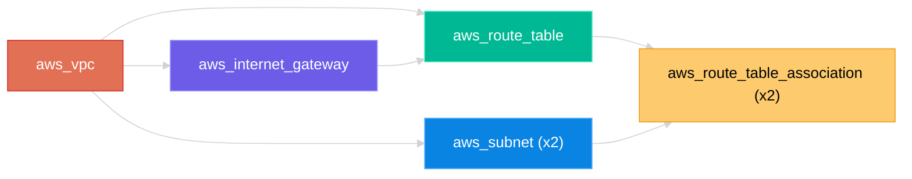

# Step 03: VPC 네트워크 기본 구축

## 학습 목표
- VPC와 CIDR 블록 이해
- Public Subnet 생성
- Internet Gateway 연결
- Route Table 설정

## 파일 구조
```
step03-vpc/
├── main.tf           # VPC, Subnet, IGW, Route Table
├── variables.tf      # 변수 정의
├── outputs.tf        # 출력값 정의
├── terraform.tfvars  # 변수값 설정
└── README.md
```

## 생성되는 리소스

```mermaid
%%{init: {'theme': 'dark', 'themeVariables': { 'primaryColor': '#1a1a2e', 'primaryTextColor': '#eee', 'primaryBorderColor': '#7C3AED', 'lineColor': '#7C3AED', 'secondaryColor': '#16213e', 'tertiaryColor': '#0f3460'}}}%%
flowchart TB
    subgraph Internet[" "]
        NET[("Internet")]
    end

    subgraph AWS["AWS Cloud"]
        IGW["Internet Gateway"]

        subgraph VPC["VPC (10.0.0.0/16)"]
            RT["Route Table
            0.0.0.0/0 → IGW"]

            subgraph AZ1["AZ: ap-northeast-2a"]
                PUB1["Public Subnet 1
                10.0.0.0/24"]
            end

            subgraph AZ2["AZ: ap-northeast-2b"]
                PUB2["Public Subnet 2
                10.0.1.0/24"]
            end
        end
    end

    NET <--> IGW
    IGW <--> RT
    RT <--> PUB1
    RT <--> PUB2

    style Internet fill:#2d3436,stroke:#00cec9,stroke-width:2px
    style AWS fill:#1a1a2e,stroke:#7C3AED,stroke-width:2px
    style VPC fill:#16213e,stroke:#00b894,stroke-width:2px
    style AZ1 fill:#0f3460,stroke:#74b9ff,stroke-width:1px
    style AZ2 fill:#0f3460,stroke:#74b9ff,stroke-width:1px
    style IGW fill:#6c5ce7,stroke:#a29bfe,stroke-width:2px,color:#fff
    style RT fill:#00b894,stroke:#55efc4,stroke-width:2px,color:#fff
    style PUB1 fill:#0984e3,stroke:#74b9ff,stroke-width:2px,color:#fff
    style PUB2 fill:#0984e3,stroke:#74b9ff,stroke-width:2px,color:#fff
    style NET fill:#fd79a8,stroke:#e84393,stroke-width:2px,color:#fff
```



### 리소스 의존 관계



## 핵심 개념

### 1. VPC (Virtual Private Cloud)
- AWS에서 논리적으로 격리된 네트워크 공간
- CIDR 블록으로 IP 범위 정의

### 2. CIDR 블록
```
10.0.0.0/16  → 65,536개 IP (10.0.0.0 ~ 10.0.255.255)
10.0.0.0/24  → 256개 IP (10.0.0.0 ~ 10.0.0.255)
```

| CIDR | IP 개수 | 용도 |
|------|---------|------|
| /16 | 65,536 | VPC 전체 |
| /24 | 256 | 서브넷 |
| /32 | 1 | 단일 IP |

### 3. Internet Gateway (IGW)
- VPC와 인터넷 간 통신 연결
- Public Subnet의 필수 요소

### 4. Route Table
- 트래픽 라우팅 규칙 정의
- `0.0.0.0/0 → IGW` = 모든 외부 트래픽을 IGW로

### 5. count를 사용한 반복 생성
```hcl
resource "aws_subnet" "public" {
  count      = 2
  cidr_block = "10.0.${count.index}.0/24"
  # count.index: 0, 1, 2, ...
}
```

### 6. Splat 표현식 (*)
```hcl
# 모든 subnet의 id를 리스트로 반환
aws_subnet.public[*].id
# 결과: ["subnet-xxx", "subnet-yyy"]
```

## 실습 명령어

### 1단계: 초기화 및 계획
```bash
cd terraform-practice/step03-vpc
terraform init
terraform plan
```

### 2단계: 리소스 생성
```bash
terraform apply
```

### 3단계: 출력값 확인
```bash
terraform output
terraform output vpc_id
terraform output public_subnet_ids
```

### 4단계: AWS 콘솔에서 확인
- VPC 콘솔 → VPC 확인
- 서브넷 확인
- 인터넷 게이트웨이 확인
- 라우트 테이블 확인

### 5단계: 리소스 삭제
```bash
terraform destroy
```

## Public vs Private Subnet

| 구분 | Public Subnet | Private Subnet |
|------|---------------|----------------|
| 인터넷 접근 | 직접 가능 (IGW) | 불가 (NAT 필요) |
| Public IP | 자동 할당 가능 | 없음 |
| 용도 | 웹서버, Bastion | DB, 내부 서비스 |
| Route Table | 0.0.0.0/0 → IGW | 0.0.0.0/0 → NAT |

## data 블록 이해

```hcl
# AWS에서 정보 조회 (생성 X)
data "aws_availability_zones" "available" {
  state = "available"
}

# 사용
data.aws_availability_zones.available.names[0]  # "ap-northeast-2a"
data.aws_availability_zones.available.names[1]  # "ap-northeast-2b"
```

## 다음 단계
Step 04에서는 NAT Gateway와 Private Subnet을 추가하여 완전한 네트워크를 구축합니다.
