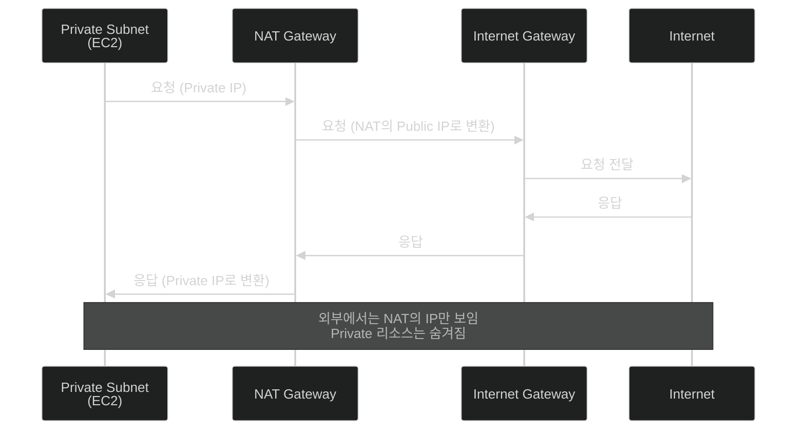
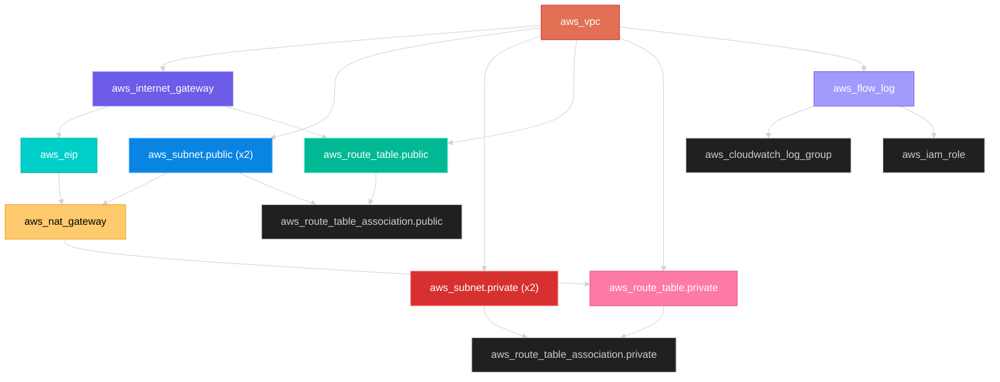

# Step 04: 완전한 VPC 네트워크 (프로덕션 레벨)

## 학습 목표
- Private Subnet 구성
- NAT Gateway로 Private Subnet 외부 통신
- Elastic IP 할당
- VPC Flow Logs (트래픽 모니터링)
- 프로덕션 레벨 태깅 전략

## 파일 구조
```
step04-nat-private/
├── main.tf           # 모든 리소스 정의
├── variables.tf      # 변수 정의 (유효성 검증 포함)
├── outputs.tf        # 출력값 정의
├── terraform.tfvars  # 변수값 설정
└── README.md
```

## 생성되는 아키텍처

```mermaid
%%{init: {'theme': 'dark', 'themeVariables': { 'primaryColor': '#1a1a2e', 'primaryTextColor': '#eee', 'primaryBorderColor': '#7C3AED', 'lineColor': '#7C3AED'}}}%%
flowchart TB
    subgraph Internet[" "]
        NET[("Internet")]
    end

    subgraph AWS["AWS Cloud"]
        subgraph Region["Region: ap-northeast-2 (Seoul)"]
            IGW["Internet Gateway"]

            subgraph VPC["VPC (10.0.0.0/16)"]
                subgraph PublicLayer["Public Layer"]
                    RT_PUB["Public RT
                    0.0.0.0/0 → IGW"]
                    NAT["NAT Gateway
                    + Elastic IP"]

                    subgraph AZ1_PUB["AZ: ap-northeast-2a"]
                        PUB1["Public Subnet 1
                        10.0.0.0/24"]
                    end

                    subgraph AZ2_PUB["AZ: ap-northeast-2b"]
                        PUB2["Public Subnet 2
                        10.0.1.0/24"]
                    end
                end

                subgraph PrivateLayer["Private Layer"]
                    RT_PRI["Private RT
                    0.0.0.0/0 → NAT"]

                    subgraph AZ1_PRI["AZ: ap-northeast-2a"]
                        PRI1["Private Subnet 1
                        10.0.10.0/24"]
                    end

                    subgraph AZ2_PRI["AZ: ap-northeast-2b"]
                        PRI2["Private Subnet 2
                        10.0.11.0/24"]
                    end
                end

                FLOW["VPC Flow Logs
                → CloudWatch"]
            end
        end
    end

    NET <--> IGW
    IGW <--> RT_PUB
    RT_PUB <--> PUB1 & PUB2
    PUB1 --> NAT
    RT_PRI --> NAT
    PRI1 & PRI2 --> RT_PRI

    style Internet fill:#2d3436,stroke:#00cec9,stroke-width:2px
    style AWS fill:#0d0d0d,stroke:#ff9900,stroke-width:3px
    style Region fill:#1a1a2e,stroke:#ff9900,stroke-width:2px
    style VPC fill:#16213e,stroke:#00b894,stroke-width:2px
    style PublicLayer fill:#0f3460,stroke:#74b9ff,stroke-width:1px
    style PrivateLayer fill:#1e3a5f,stroke:#fd79a8,stroke-width:1px
    style IGW fill:#6c5ce7,stroke:#a29bfe,stroke-width:2px,color:#fff
    style NAT fill:#e17055,stroke:#d63031,stroke-width:2px,color:#fff
    style RT_PUB fill:#00b894,stroke:#55efc4,stroke-width:2px,color:#fff
    style RT_PRI fill:#fdcb6e,stroke:#f39c12,stroke-width:2px,color:#000
    style PUB1 fill:#0984e3,stroke:#74b9ff,stroke-width:2px,color:#fff
    style PUB2 fill:#0984e3,stroke:#74b9ff,stroke-width:2px,color:#fff
    style PRI1 fill:#d63031,stroke:#ff7675,stroke-width:2px,color:#fff
    style PRI2 fill:#d63031,stroke:#ff7675,stroke-width:2px,color:#fff
    style AZ1_PUB fill:#0f3460,stroke:#74b9ff,stroke-width:1px
    style AZ2_PUB fill:#0f3460,stroke:#74b9ff,stroke-width:1px
    style AZ1_PRI fill:#1e3a5f,stroke:#fd79a8,stroke-width:1px
    style AZ2_PRI fill:#1e3a5f,stroke:#fd79a8,stroke-width:1px
    style NET fill:#fd79a8,stroke:#e84393,stroke-width:2px,color:#fff
    style FLOW fill:#a29bfe,stroke:#6c5ce7,stroke-width:2px,color:#fff
```



## 핵심 개념

### 1. Public vs Private Subnet

| 구분 | Public Subnet | Private Subnet |
|------|---------------|----------------|
| 인터넷 → 리소스 | ✅ 가능 | ❌ 불가 |
| 리소스 → 인터넷 | ✅ IGW 통해 직접 | ✅ NAT 통해 간접 |
| Public IP | 자동 할당 | 없음 |
| Route Table | 0.0.0.0/0 → IGW | 0.0.0.0/0 → NAT |
| 용도 | 웹서버, LB, Bastion | DB, 앱서버, EKS 노드 |

### 2. NAT Gateway



### 3. Elastic IP (EIP)
- NAT Gateway에 할당되는 고정 Public IP
- NAT Gateway 삭제 전까지 IP 유지
- 화이트리스트 기반 외부 API 연동 시 필요

### 4. VPC Flow Logs
- VPC 내 모든 트래픽 로깅
- 보안 감사, 트러블슈팅에 필수
- CloudWatch Logs로 전송

## 프로덕션 기능

### 1. default_tags (Provider 레벨 태깅)
```hcl
provider "aws" {
  default_tags {
    tags = {
      Project     = var.project_name
      Environment = var.environment
      ManagedBy   = "Terraform"
    }
  }
}
```
→ 모든 리소스에 자동 태그 적용

### 2. EKS 호환 태그
```hcl
# Public Subnet
"kubernetes.io/role/elb" = "1"

# Private Subnet
"kubernetes.io/role/internal-elb" = "1"
```
→ EKS가 로드밸런서 생성 시 자동으로 서브넷 선택

### 3. 조건부 리소스 생성
```hcl
resource "aws_nat_gateway" "main" {
  count = var.enable_nat_gateway ? 1 : 0
  # ...
}
```
→ 변수로 리소스 생성 여부 제어

### 4. dynamic 블록
```hcl
dynamic "route" {
  for_each = var.enable_nat_gateway ? [1] : []
  content {
    cidr_block     = "0.0.0.0/0"
    nat_gateway_id = aws_nat_gateway.main[0].id
  }
}
```
→ 조건에 따라 블록 동적 생성

## 실습 명령어

### 1단계: 초기화 및 계획
```bash
cd terraform-practice/step04-nat-private
terraform init
terraform plan
```

### 2단계: 리소스 생성
```bash
terraform apply
```

### 3단계: 출력값 확인
```bash
terraform output
terraform output network_summary
terraform output nat_gateway_public_ip
```

### 4단계: AWS 콘솔에서 확인
- VPC → 서브넷 (Public/Private 구분)
- NAT Gateway 확인
- Elastic IP 확인
- Route Table (Public vs Private 비교)
- CloudWatch → Log Groups → Flow Logs

### 5단계: 비용 절감 테스트
```bash
# NAT Gateway 비활성화 (비용 절감)
terraform apply -var="enable_nat_gateway=false"
```

### 6단계: 리소스 삭제
```bash
terraform destroy
```

## 비용 정보

| 리소스 | 비용 (서울 리전) |
|--------|-----------------|
| NAT Gateway | ~$0.045/시간 (~$32/월) |
| NAT 데이터 처리 | $0.045/GB |
| Elastic IP (사용 중) | 무료 |
| Elastic IP (미사용) | ~$0.005/시간 |
| VPC Flow Logs | CloudWatch 요금 |

**실습 시 비용 절감 팁:**
```hcl
enable_nat_gateway = false  # NAT Gateway 비활성화
enable_flow_logs   = false  # Flow Logs 비활성화
```

## 리소스 의존 관계



## 다음 단계
Step 05에서는 ECR(컨테이너 레지스트리)를 구축합니다.
