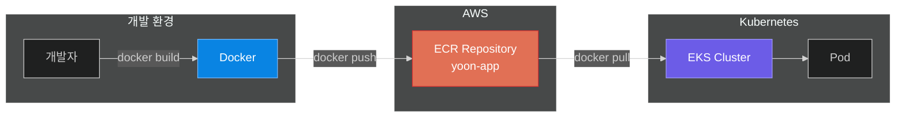

# Step 05: ECR (Elastic Container Registry)

## 학습 목표
- ECR Repository 생성
- 이미지 태그 불변성 (보안)
- Lifecycle Policy로 비용 관리
- 이미지 Push/Pull 실습

## 파일 구조
```
step05-ecr/
├── main.tf           # ECR 리소스 정의
├── variables.tf      # 변수 정의
├── outputs.tf        # 출력값 (로그인 명령어 등)
├── terraform.tfvars  # 변수값 설정
└── README.md
```

## ECR이란?



**AWS의 Docker Hub** - 프라이빗 컨테이너 이미지 저장소

## 프로덕션 설정

### 1. IMMUTABLE 태그
```hcl
image_tag_mutability = "IMMUTABLE"
```
- 같은 태그로 다른 이미지 덮어쓰기 방지
- `v1.0.0` 태그는 항상 같은 이미지 보장
- 배포 신뢰성 향상

### 2. 이미지 스캔
```hcl
image_scanning_configuration {
  scan_on_push = true
}
```
- Push 시 자동 취약점 스캔
- CVE 데이터베이스와 비교
- AWS 콘솔에서 결과 확인

### 3. Lifecycle Policy
```hcl
countNumber = 10  # 최근 10개만 유지
```
- 오래된 이미지 자동 삭제
- 스토리지 비용 절감

## 실습 명령어

### 1단계: 리소스 생성
```bash
cd terraform-practice/step05-ecr
terraform init
terraform plan
terraform apply
```

### 2단계: 출력값 확인
```bash
terraform output
terraform output docker_login_command
```

### 3단계: ECR 로그인
```bash
# 출력된 명령어 실행
aws ecr get-login-password --region ap-northeast-2 | \
  docker login --username AWS --password-stdin \
  <ACCOUNT_ID>.dkr.ecr.ap-northeast-2.amazonaws.com
```

### 4단계: 이미지 Push 테스트
```bash
# 간단한 테스트 이미지 생성
echo 'FROM nginx:alpine' > Dockerfile
docker build -t test-app .

# 태깅
docker tag test-app:latest <REPOSITORY_URL>:v1.0.0

# Push
docker push <REPOSITORY_URL>:v1.0.0
```

### 5단계: AWS 콘솔에서 확인
- ECR → Repositories → yoon-app
- 이미지 목록 확인
- 취약점 스캔 결과 확인

### 6단계: 리소스 삭제
```bash
# 이미지가 있으면 먼저 삭제 필요
aws ecr batch-delete-image \
  --repository-name yoon-app \
  --image-ids imageTag=v1.0.0

terraform destroy
```

## MUTABLE vs IMMUTABLE

| 설정 | MUTABLE | IMMUTABLE |
|------|---------|-----------|
| 태그 덮어쓰기 | ✅ 가능 | ❌ 불가 |
| 같은 태그 재사용 | 가능 | 에러 발생 |
| 용도 | 개발환경 | **프로덕션** |
| 예시 | `latest` 태그 | `v1.0.0` 태그 |

### IMMUTABLE 권장 이유
```
v1.0.0 → 이미지 A (배포됨)
v1.0.0 → 이미지 B (덮어쓰기 시도)
         ↓
    ❌ 에러! (기존 이미지 보호)
```

## 비용

| 항목 | 비용 |
|------|------|
| 스토리지 | $0.10/GB/월 |
| 데이터 전송 (같은 리전) | 무료 |
| 데이터 전송 (다른 리전) | $0.01/GB |

**Lifecycle Policy로 비용 절감!**

## 다음 단계
Step 06에서는 EKS(Kubernetes) 클러스터를 구축합니다.
