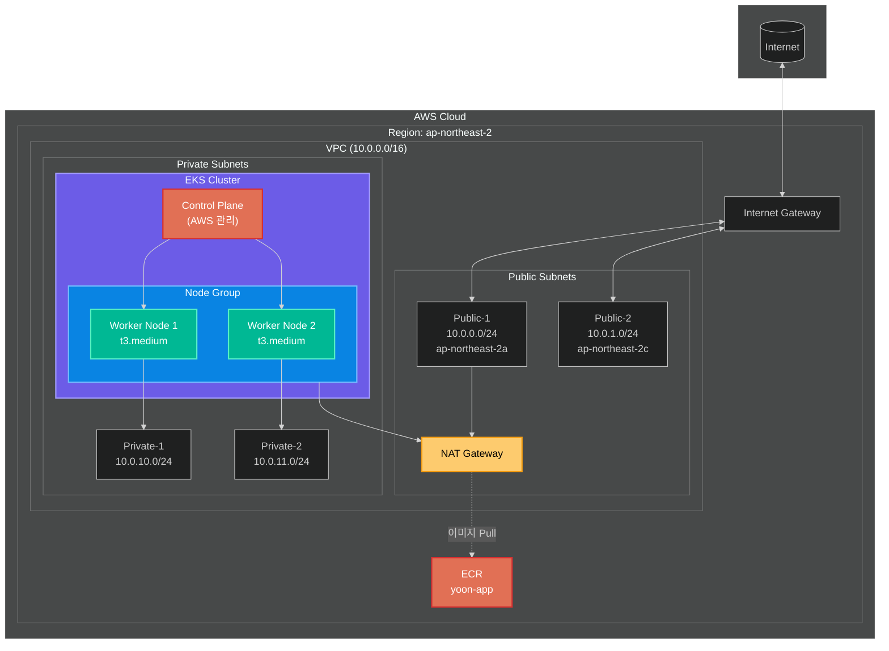

# Step 06: EKS (Elastic Kubernetes Service)

## 학습 목표
- EKS 클러스터 생성
- Managed Node Group 구성
- IAM Role 설정 이해
- kubectl 연결

## 파일 구조 (실무 표준)
```
step06-eks/
├── versions.tf      # Terraform/Provider 버전
├── variables.tf     # 변수 정의
├── vpc.tf           # VPC, Subnet, NAT 등 네트워크
├── iam.tf           # IAM Role, Policy
├── eks.tf           # EKS Cluster, Node Group
├── outputs.tf       # 출력값
├── terraform.tfvars # 변수값 설정
└── README.md
```

**왜 파일을 나누나요?**
- 역할별 관리 용이
- 팀 협업 시 충돌 최소화
- 코드 가독성 향상

## 아키텍처



## EKS 구성요소

### 1. Control Plane (AWS 관리)
- API Server, etcd, Scheduler 등
- AWS가 자동 관리 (고가용성)
- 비용: 시간당 $0.10

### 2. Node Group (우리가 관리)
- 실제 Pod가 실행되는 EC2
- Managed Node Group 사용 (자동 업데이트)
- Auto Scaling 지원

### 3. IAM Roles

| Role | 목적 | 정책 |
|------|------|------|
| eks-cluster-role | Control Plane 권한 | AmazonEKSClusterPolicy |
| eks-node-role | Worker Node 권한 | AmazonEKSWorkerNodePolicy, AmazonEKS_CNI_Policy, AmazonEC2ContainerRegistryReadOnly |

## 실습 명령어

### 1단계: 리소스 생성
```bash
cd terraform-practice/step06-eks
terraform init
terraform plan
terraform apply
```

> ⏰ **EKS 생성에 약 15-20분 소요됩니다**

### 2단계: kubectl 설정
```bash
# 출력된 명령어 확인
terraform output kubectl_config_command

# kubeconfig 업데이트
aws eks update-kubeconfig --region ap-northeast-2 --name yoon-eks
```

### 3단계: 클러스터 확인
```bash
# 클러스터 정보
kubectl cluster-info

# 노드 확인
kubectl get nodes

# 네임스페이스 확인
kubectl get namespaces
```

### 4단계: 간단한 배포 테스트
```bash
# nginx 배포
kubectl create deployment nginx --image=nginx

# 확인
kubectl get pods
kubectl get deployments

# 정리
kubectl delete deployment nginx
```

### 5단계: 리소스 삭제
```bash
# 먼저 K8s 리소스 정리
kubectl delete all --all

# Terraform 삭제 (10-15분 소요)
terraform destroy
```

## Subnet 태그의 의미

```hcl
# Public Subnet
"kubernetes.io/role/elb" = "1"  # 외부 LB용

# Private Subnet
"kubernetes.io/role/internal-elb" = "1"  # 내부 LB용

# 공통
"kubernetes.io/cluster/yoon-eks" = "shared"  # 클러스터 식별
```

EKS가 자동으로 LoadBalancer를 생성할 때 이 태그를 참조합니다.

## 비용 (서울 리전 기준)

| 항목 | 비용 |
|------|------|
| EKS Control Plane | $0.10/시간 (~$73/월) |
| t3.medium x 2 | $0.052/시간 x 2 (~$75/월) |
| NAT Gateway | $0.059/시간 (~$43/월) |
| **총 예상** | **~$190/월** |

> 💡 학습 후 반드시 `terraform destroy`로 삭제하세요!

## 트러블슈팅

### kubectl 연결 안될 때
```bash
# AWS 자격증명 확인
aws sts get-caller-identity

# kubeconfig 재설정
aws eks update-kubeconfig --region ap-northeast-2 --name yoon-eks
```

### 노드가 Ready 안될 때
```bash
# 노드 상태 확인
kubectl describe nodes

# 보통 IAM Role 문제 → AWS 콘솔에서 확인
```

## 다음 단계
Step 07에서는 CI/CD 파이프라인(Jenkins 또는 GitHub Actions)을 구축합니다.
