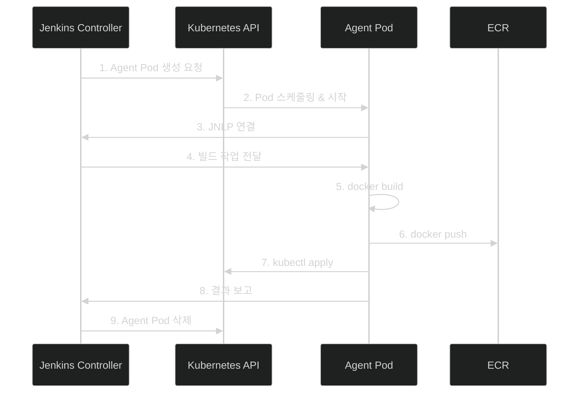

# Step 07: CI/CD (Jenkins on EKS with Helm)

## 학습 목표
- Helm으로 EKS에 Jenkins 설치
- Kubernetes Agent Pod (동적 빌드 환경)
- IRSA (IAM Roles for Service Accounts)
- CodeCommit 연동
- ECR Push & EKS 배포 파이프라인

## 파일 구조
```
step07-cicd/
├── jenkins-values.yaml   # Helm values (Jenkins 설정)
├── jenkins-sa.yaml       # ServiceAccount (IRSA)
├── jenkins-rbac.yaml     # RBAC (K8s 권한)
├── iam-policy.json       # IAM 정책 (ECR, EKS 접근)
├── Jenkinsfile           # Pipeline 예제
└── README.md
```

## 아키텍처

```mermaid
%%{init: {'theme': 'dark', 'themeVariables': { 'primaryColor': '#1a1a2e', 'primaryTextColor': '#eee'}}}%%
flowchart TB
    subgraph Internet[" "]
        DEV[("개발자")]
        USER[("사용자")]
    end

    subgraph AWS["AWS Cloud"]
        subgraph Region["Region: ap-northeast-2 (Seoul)"]
            CODECOMMIT["CodeCommit<br/>yoon-app"]
            ECR["ECR<br/>yoon-app"]
            IAM["IAM Role<br/>(IRSA)"]

            subgraph VPC["VPC (10.0.0.0/16)"]
                IGW["Internet Gateway"]

                subgraph PublicLayer["Public Subnets"]
                    subgraph PUB_AZ1["AZ: ap-northeast-2a"]
                        PUB1["Public Subnet 1<br/>10.0.0.0/24"]
                        NAT["NAT Gateway"]
                    end
                    subgraph PUB_AZ2["AZ: ap-northeast-2c"]
                        PUB2["Public Subnet 2<br/>10.0.1.0/24"]
                    end
                    LB["LoadBalancer<br/>(Jenkins UI)"]
                end

                subgraph PrivateLayer["Private Subnets"]
                    subgraph PRI_AZ1["AZ: ap-northeast-2a"]
                        PRI1["Private Subnet 1<br/>10.0.10.0/24"]
                    end
                    subgraph PRI_AZ2["AZ: ap-northeast-2c"]
                        PRI2["Private Subnet 2<br/>10.0.11.0/24"]
                    end

                    subgraph EKS["EKS Cluster (yoon-eks)"]
                        CTRL["Control Plane<br/>(AWS 관리)"]

                        subgraph NodeGroup["Node Group (Private)"]
                            subgraph Node1["Worker Node 1"]
                                subgraph JenkinsNS["NS: jenkins"]
                                    JENKINS["Jenkins<br/>Controller Pod"]
                                    AGENT["Agent Pod<br/>(빌드 시 생성)"]
                                end
                            end

                            subgraph Node2["Worker Node 2"]
                                subgraph DefaultNS["NS: default"]
                                    APP1["App Pod 1"]
                                    APP2["App Pod 2"]
                                end
                            end
                        end
                    end
                end
            end
        end
    end

    %% 개발자 흐름
    DEV -->|1. git push| CODECOMMIT
    CODECOMMIT -->|2. Poll| JENKINS
    JENKINS -->|3. Agent 생성| AGENT
    AGENT -->|4. docker push| ECR
    AGENT -->|5. kubectl apply| APP1 & APP2
    APP1 & APP2 -.->|6. image pull| ECR

    %% 사용자 흐름
    USER -->|HTTP 접속| LB
    LB -->|:8080| JENKINS

    %% 네트워크 흐름
    IGW <--> PUB1 & PUB2
    NodeGroup -->|아웃바운드| NAT
    NAT --> IGW

    %% IRSA
    JENKINS -.->|IRSA| IAM
    IAM -.->|ECR/EKS 권한| ECR

    %% 스타일
    style DEV fill:#fd79a8,stroke:#e84393,stroke-width:2px,color:#fff
    style USER fill:#a29bfe,stroke:#6c5ce7,stroke-width:2px,color:#fff
    style CODECOMMIT fill:#fdcb6e,stroke:#f39c12,stroke-width:2px,color:#000
    style ECR fill:#6c5ce7,stroke:#a29bfe,stroke-width:2px,color:#fff
    style IAM fill:#a29bfe,stroke:#6c5ce7,stroke-width:2px,color:#fff
    style VPC fill:#16213e,stroke:#00b894,stroke-width:2px
    style PublicLayer fill:#0f3460,stroke:#74b9ff,stroke-width:1px
    style PrivateLayer fill:#1e3a5f,stroke:#fd79a8,stroke-width:1px
    style EKS fill:#2d3436,stroke:#6c5ce7,stroke-width:2px
    style NodeGroup fill:#0984e3,stroke:#74b9ff,stroke-width:2px
    style JENKINS fill:#e17055,stroke:#d63031,stroke-width:2px,color:#fff
    style AGENT fill:#fdcb6e,stroke:#f39c12,stroke-width:2px,color:#000
    style APP1 fill:#00b894,stroke:#55efc4,stroke-width:2px,color:#fff
    style APP2 fill:#00b894,stroke:#55efc4,stroke-width:2px,color:#fff
    style LB fill:#e17055,stroke:#d63031,stroke-width:2px,color:#fff
    style NAT fill:#fdcb6e,stroke:#f39c12,stroke-width:2px,color:#000
    style IGW fill:#6c5ce7,stroke:#a29bfe,stroke-width:2px,color:#fff
    style CTRL fill:#e17055,stroke:#d63031,stroke-width:2px,color:#fff
```



## 인프라 구성 요약 (Step 06 + Step 07)

| 구성요소 | 위치 | 설명 |
|---------|------|------|
| **VPC** | - | 10.0.0.0/16 |
| **Public Subnet 1** | ap-northeast-2a | 10.0.0.0/24, NAT Gateway |
| **Public Subnet 2** | ap-northeast-2c | 10.0.1.0/24 |
| **Private Subnet 1** | ap-northeast-2a | 10.0.10.0/24, Worker Node |
| **Private Subnet 2** | ap-northeast-2c | 10.0.11.0/24, Worker Node |
| **EKS Control Plane** | AWS 관리 | API Server, etcd |
| **Worker Nodes** | Private Subnet | t3.medium x 2 |
| **Jenkins Pod** | jenkins namespace | Helm으로 설치 |
| **Agent Pod** | jenkins namespace | 빌드 시 동적 생성 |
| **App Pods** | default namespace | 배포된 애플리케이션 |
| **LoadBalancer** | Public | Jenkins UI 노출 |

## EC2 Jenkins vs EKS Jenkins 비교

| 항목 | EC2 Jenkins | EKS Jenkins (Helm) |
|------|-------------|-------------------|
| 설치 방법 | Terraform + user_data | Helm Chart |
| 빌드 환경 | EC2 내 고정 | Agent Pod 동적 생성 |
| 확장성 | 수동 스케일링 | 자동 스케일링 |
| 리소스 효율 | 항상 EC2 비용 발생 | 빌드 시에만 Pod 생성 |
| 고가용성 | 별도 구성 필요 | K8s가 자동 관리 |
| **실무 선호도** | 소규모 | **중/대규모** |

---

## 전체 실습 흐름

```
┌─────────────────────────────────────────────────────────────────────┐
│  STEP A: 사전 준비                                                   │
│  ─────────────────                                                  │
│  1. Step 06 (EKS) 배포 완료 확인                                      │
│  2. kubectl 연결 확인                                                │
│  3. Helm 설치                                                       │
└─────────────────────────────────────────────────────────────────────┘
                                    ↓
┌─────────────────────────────────────────────────────────────────────┐
│  STEP B: IAM Role 생성 (IRSA)                                        │
│  ────────────────────────────                                       │
│  1. OIDC Provider 확인                                               │
│  2. IAM Policy 생성                                                  │
│  3. IAM Role 생성 (ServiceAccount 연결)                               │
└─────────────────────────────────────────────────────────────────────┘
                                    ↓
┌─────────────────────────────────────────────────────────────────────┐
│  STEP C: Jenkins 설치 (Helm)                                         │
│  ───────────────────────────                                        │
│  1. Namespace 생성                                                   │
│  2. RBAC 적용                                                        │
│  3. Helm으로 Jenkins 설치                                             │
│  4. 초기 비밀번호 확인 & 로그인                                          │
└─────────────────────────────────────────────────────────────────────┘
                                    ↓
┌─────────────────────────────────────────────────────────────────────┐
│  STEP D: Pipeline 설정                                               │
│  ────────────────────                                               │
│  1. CodeCommit 저장소 + Jenkinsfile 준비                               │
│  2. Jenkins에서 Credentials 등록                                      │
│  3. Pipeline 생성 & Build Now                                        │
└─────────────────────────────────────────────────────────────────────┘
```

---

## STEP A: 사전 준비

### A-1. EKS 클러스터 확인
```bash
# Step 06이 배포되어 있는지 확인
cd terraform-practice/step06-eks
terraform output cluster_name

# kubectl 연결 확인
kubectl get nodes
```

### A-2. Helm 설치
```bash
# macOS
brew install helm

# Linux
curl https://raw.githubusercontent.com/helm/helm/main/scripts/get-helm-3 | bash

# 버전 확인
helm version
```

### A-3. Jenkins Helm 저장소 추가
```bash
helm repo add jenkins https://charts.jenkins.io
helm repo update
```

---

## STEP B: IAM Role 생성 (IRSA)

IRSA(IAM Roles for Service Accounts)를 사용하면 Pod에 IAM 권한을 부여할 수 있습니다.

### B-1. OIDC Provider 확인
```bash
# EKS 클러스터의 OIDC URL 확인
aws eks describe-cluster --name yoon-eks --query "cluster.identity.oidc.issuer" --output text

# 출력 예: https://oidc.eks.ap-northeast-2.amazonaws.com/id/EXAMPLED539D4633E53DE1B71EXAMPLE
```

### B-2. OIDC Provider가 없으면 생성
```bash
# eksctl 사용 (권장)
eksctl utils associate-iam-oidc-provider --cluster yoon-eks --approve

# 또는 AWS 콘솔: IAM → Identity providers → Add provider
```

### B-3. IAM Policy 생성
```bash
cd terraform-practice/step07-cicd

# Policy 생성
aws iam create-policy \
  --policy-name yoon-jenkins-policy \
  --policy-document file://iam-policy.json
```

### B-4. IAM Role 생성 (IRSA용)
```bash
# 변수 설정
ACCOUNT_ID=$(aws sts get-caller-identity --query Account --output text)
OIDC_ID=$(aws eks describe-cluster --name yoon-eks --query "cluster.identity.oidc.issuer" --output text | cut -d'/' -f5)

# Trust Policy 생성
cat > trust-policy.json << EOF
{
  "Version": "2012-10-17",
  "Statement": [
    {
      "Effect": "Allow",
      "Principal": {
        "Federated": "arn:aws:iam::${ACCOUNT_ID}:oidc-provider/oidc.eks.ap-northeast-2.amazonaws.com/id/${OIDC_ID}"
      },
      "Action": "sts:AssumeRoleWithWebIdentity",
      "Condition": {
        "StringEquals": {
          "oidc.eks.ap-northeast-2.amazonaws.com/id/${OIDC_ID}:sub": "system:serviceaccount:jenkins:jenkins"
        }
      }
    }
  ]
}
EOF

# Role 생성
aws iam create-role \
  --role-name yoon-jenkins-irsa-role \
  --assume-role-policy-document file://trust-policy.json

# Policy 연결
aws iam attach-role-policy \
  --role-name yoon-jenkins-irsa-role \
  --policy-arn arn:aws:iam::${ACCOUNT_ID}:policy/yoon-jenkins-policy

echo "Role ARN: arn:aws:iam::${ACCOUNT_ID}:role/yoon-jenkins-irsa-role"
```

---

## STEP C: Jenkins 설치 (Helm)

### C-1. Namespace 생성
```bash
kubectl create namespace jenkins
```

### C-2. ServiceAccount 수정 (IRSA 연결)
```bash
# jenkins-sa.yaml에서 ACCOUNT_ID 수정
ACCOUNT_ID=$(aws sts get-caller-identity --query Account --output text)
sed -i '' "s/ACCOUNT_ID/${ACCOUNT_ID}/g" jenkins-sa.yaml

# 적용
kubectl apply -f jenkins-sa.yaml
```

### C-3. RBAC 적용
```bash
kubectl apply -f jenkins-rbac.yaml
```

### C-4. Helm으로 Jenkins 설치
```bash
# values 파일 수정 (IRSA Role ARN 추가)
# jenkins-values.yaml의 serviceAccount.annotations 부분 수정

helm install jenkins jenkins/jenkins \
  -n jenkins \
  -f jenkins-values.yaml \
  --wait
```

### C-5. 설치 확인
```bash
# Pod 상태 확인
kubectl get pods -n jenkins -w

# 모든 리소스 확인
kubectl get all -n jenkins
```

### C-6. Jenkins URL 확인
```bash
# LoadBalancer URL 확인 (1-2분 대기)
kubectl get svc jenkins -n jenkins

# 출력 예:
# NAME      TYPE           EXTERNAL-IP                                    PORT(S)
# jenkins   LoadBalancer   a1b2c3d4.ap-northeast-2.elb.amazonaws.com     8080:31234/TCP
```

### C-7. 초기 비밀번호 확인
```bash
# 자동 생성된 admin 비밀번호
kubectl exec -n jenkins -it svc/jenkins -c jenkins -- /bin/cat /run/secrets/additional/chart-admin-password

# 또는
kubectl get secret jenkins -n jenkins -o jsonpath="{.data.jenkins-admin-password}" | base64 --decode
```

### C-8. Jenkins 접속
```
URL: http://<EXTERNAL-IP>:8080
Username: admin
Password: (C-7에서 확인한 비밀번호)
```

---

## STEP D: Pipeline 설정

### D-1. CodeCommit 저장소 준비

**AWS 콘솔 → CodeCommit → 리포지토리 생성**
- 이름: `yoon-app`

**Git 자격증명 생성 (IAM → 사용자 → 보안 자격 증명)**

### D-2. 샘플 프로젝트 Push
```bash
git clone https://git-codecommit.ap-northeast-2.amazonaws.com/v1/repos/yoon-app
cd yoon-app

# Dockerfile
cat > Dockerfile << 'EOF'
FROM nginx:alpine
COPY index.html /usr/share/nginx/html/
EXPOSE 80
EOF

# index.html
cat > index.html << 'EOF'
<!DOCTYPE html>
<html>
<body><h1>Hello from EKS!</h1></body>
</html>
EOF

# Jenkinsfile 복사
cp ../terraform-practice/step07-cicd/Jenkinsfile .

# Push
git add . && git commit -m "Initial commit" && git push
```

### D-3. Jenkins에서 Credentials 등록

**Jenkins → Manage Jenkins → Credentials → System → Global credentials**

1. **Add Credentials**
2. Kind: `Username with password`
3. Username: (CodeCommit Git 자격증명)
4. Password: (CodeCommit Git 자격증명)
5. ID: `codecommit-credentials`
6. **Create**

### D-4. Pipeline 생성

**Jenkins → New Item**

1. 이름: `yoon-app`
2. 타입: `Pipeline`
3. **OK**

**Pipeline 설정:**
- Definition: `Pipeline script from SCM`
- SCM: `Git`
- Repository URL: `https://git-codecommit.ap-northeast-2.amazonaws.com/v1/repos/yoon-app`
- Credentials: `codecommit-credentials`
- Branch: `*/main`
- Script Path: `Jenkinsfile`

**Save**

### D-5. Pipeline 실행

1. **Build Now** 클릭
2. 빌드 진행 상황 확인
3. Console Output에서 로그 확인

```
Agent Pod 생성 → Checkout → Build → Push to ECR → Deploy to EKS
                              ↓
                    🎉 파이프라인 성공!
```

---

## Agent Pod 동작 방식



**장점:**
- 빌드할 때만 Pod 생성 → 리소스 절약
- 빌드 환경 격리 (각 빌드마다 새 Pod)
- 다양한 빌드 환경 지원 (Pod 템플릿)

---

## Jenkinsfile 설명

```groovy
pipeline {
    agent {
        kubernetes {
            yaml '''
            # Agent Pod 정의
            # - docker: Docker 빌드용 (DinD)
            # - aws-kubectl: AWS CLI + kubectl
            '''
        }
    }

    stages {
        stage('Checkout')     // CodeCommit에서 코드 가져오기
        stage('Build')        // container('docker')에서 docker build
        stage('Push to ECR')  // ECR 로그인 + push
        stage('Deploy')       // container('aws-kubectl')에서 kubectl
    }
}
```

---

## 트러블슈팅

### Agent Pod가 생성 안될 때
```bash
# Pod 이벤트 확인
kubectl get events -n jenkins --sort-by='.lastTimestamp'

# Jenkins 로그 확인
kubectl logs -n jenkins -l app.kubernetes.io/component=jenkins-controller
```

### ECR Push 실패 (권한 오류)
```bash
# IRSA 설정 확인
kubectl describe sa jenkins -n jenkins

# Pod에 Role이 연결되었는지 확인
kubectl exec -n jenkins -it <pod-name> -- aws sts get-caller-identity
```

### kubectl 명령 실패
```bash
# RBAC 확인
kubectl auth can-i get pods --as=system:serviceaccount:jenkins:jenkins

# ClusterRoleBinding 확인
kubectl get clusterrolebinding jenkins-cluster-role-binding -o yaml
```

---

## 비용

| 항목 | 비용 |
|------|------|
| Jenkins Pod (상시) | ~$10/월 (리소스 요청 기준) |
| Agent Pod (빌드 시) | 빌드 시간에 비례 |
| LoadBalancer | ~$20/월 |
| **총 예상** | **~$30/월** (EKS 비용 별도) |

> EC2 Jenkins (~$40/월)보다 저렴하고 효율적!

---

## 리소스 삭제

```bash
# Jenkins 삭제
helm uninstall jenkins -n jenkins

# Namespace 삭제
kubectl delete namespace jenkins

# IAM 정리 (선택)
ACCOUNT_ID=$(aws sts get-caller-identity --query Account --output text)
aws iam detach-role-policy --role-name yoon-jenkins-irsa-role --policy-arn arn:aws:iam::${ACCOUNT_ID}:policy/yoon-jenkins-policy
aws iam delete-role --role-name yoon-jenkins-irsa-role
aws iam delete-policy --policy-arn arn:aws:iam::${ACCOUNT_ID}:policy/yoon-jenkins-policy
```

---

## 다음 단계
Step 08에서는 Kubernetes 리소스(Deployment, Service, Ingress)를 생성하여 실제 애플리케이션을 외부에 노출합니다.
